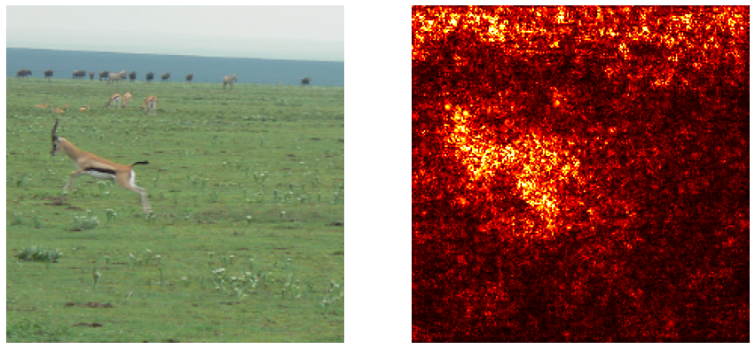
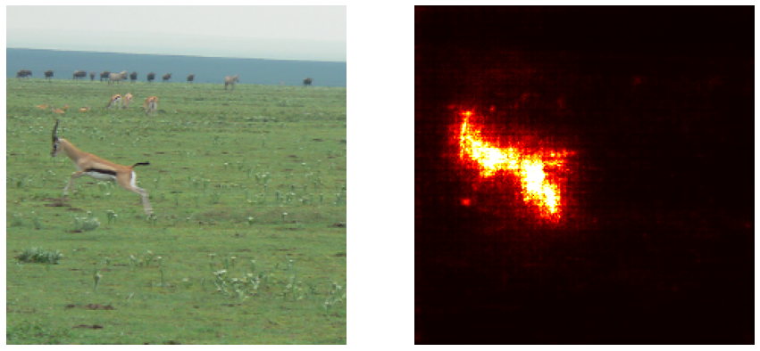
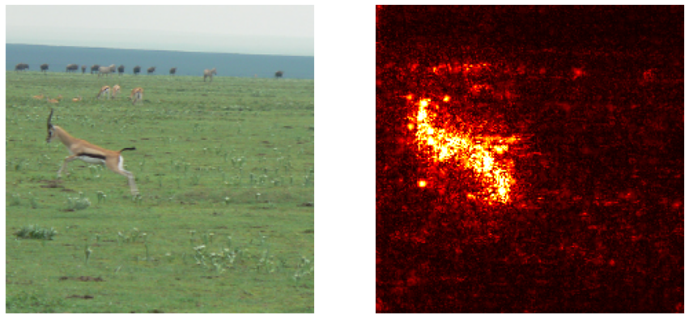

# torchvex

## Visual Explanation Methods for pyTorch
- PyTorch friendly
- More utilization of GPU.
- Higher-order derivative friendly
- Batch processing

## Usage

```sh
pip install -r requirements.txt
python setup.py install
```

## requirements

- pytorch >= 1.7 (finally torch.quantile)
- tqdm
- ***TBD***

optional
- [captum](https://captum.ai/) (for now. for DeepLift)

---

## Class Activation Mapping based Methods
- **C**lass **A**ctivation **M**apping(*CAM*)
  - paper (*CVPR* 2016): [Learning Deep Features for Discriminative Localization](https://arxiv.org/pdf/1512.04150.pdf)
  - original source code: https://github.com/zhoubolei/CAM

| functionality | progress |
| --- | --- |
| `Higher order derivative` | :heavy_check_mark: |
| `Batch processing` | :heavy_check_mark: |
| `Post processing` | :heavy_check_mark: |
| `Pre processing` | :heavy_check_mark: |

Expample: 
```python
from torchvision.models import resnet50
from torchvex import CAM

# in case of torchvision.models.resnet,
# the output of the model.layer4 is equals to
# the output of the last conv-bn-relu layer
resnet = resnet50(pretrained=True).eval()
cam_generator = CAM(resnet, target_layer=model.layer4, fc_layer=model.fc)

# if no target is passed,
# the predicted class is used as the target.
cam = cam_generator(image)
cam = cam_generator(image, target)
```

Result:

torchvex/cam/cat_dog.jpg (I don't know where the source is this image.)


- **Grad**ient-weighted **C**lass **A**ctivation **M**apping(*Grad-CAM*)
  - paper (*ICCV* 2017): [Grad-CAM: Visual Explanations from Deep Networks via Gradient-based Localization](https://openaccess.thecvf.com/content_iccv_2017/html/Selvaraju_Grad-CAM_Visual_Explanations_ICCV_2017_paper.html)
  - original source code: ***TBD***

| functionality | progress |
| --- | --- |
| `Higher order derivative` | :heavy_check_mark: |
| `Batch processing` | :heavy_check_mark: |
| `Post processing` | :heavy_check_mark: |
| `Pre processing` | :heavy_check_mark: |

Example:
```python
from torchvex import GradCAM
model = ...
grad_cam_generator = GradCAM(model, target_layer=model.layer4)
multil_layer_gcamgen = GradCAM(model, target_layer=[model.layer3, model.layer4])

grad_cam = grad_cam_generator(image)
grad_cam = grad_cam_generator(image, target)

multiple_grad_cam = multil_layer_gcamgen(image)
# multiple_grad_cam.shape: torch.Size([2, 1, image.size(-2), image.size(-1)])
```

Results:

torchvex/cam/cat_dog.jpg (I don't know where the source is this image.)


---

## DeepLift

- **Deep** **L**earning **I**mportant **F**ea**T**ures
  - ***For now, it is just a wrapper class of the  [`captum`](https://captum.ai/)`.attr.DeepLift`***
  - paper (*arXiv preprint* 2017):
  [Learning Important Features Through Propagating Activation Differences](https://arxiv.org/abs/1704.02685)
  - original source code: https://github.com/kundajelab/deeplift

---

## RISE

- **R**andomized **I**mage **S**ampling for **E**xplanations
  - paper (*BMVC*, 2018): [RISE: Randomized Input Sampling for Explanation of Black-box Models](https://arxiv.org/abs/1806.07421)
  - original source code: https://github.com/eclique/RISE

| functionality | progress |
| --- | --- |
| `Higher order derivative` | :no_good: |
| `Batch processing` | :heavy_check_mark: |
| `Post processing` | :heavy_check_mark: |
| `Pre processing` | :heavy_check_mark: |

Example:
```python
from torchvex import RISE

model = ...
rise_generator = RISE(model, num_masks=8000, cell_size=7,
                      probability=0.5, batch_size=256)

rise = rise_generator(image)
rise = rise_generator(image, target)
```

---

## Meaningful Perturbation
- Interpretable Explanations of Black Boxes by **Meaningful Perturbation**
  - paper (*ICCV* 2017): [Interpretable Explanations of Black Boxes by Meaningful Perturbation](https://openaccess.thecvf.com/content_iccv_2017/html/Fong_Interpretable_Explanations_of_ICCV_2017_paper.html)
  - original source code: https://github.com/ruthcfong/perturb_explanations
  - The result of this code is fairly different from original source code. Because:
    - Caffe model :left_right_arrow: PyTorch model
    - Scipy gaussian filtering :left_right_arrow: torchvision gaussian blurring
    - Native resize :left_right_arrow: pytorch interpolate
  - But it is more numerically stable (with `torch.autograd`) and faster.
    - original code: 3 min. :left_right_arrow: this code 10 sec. (with Titan XP, Intel(R) Xeon(R) CPU E5-2640 v3 @ 2.60GHz)

| functionality | progress |
| --- | --- |
| `Higher order derivative` | :no_good: |
| `Batch processing` | :x: |
| `Post processing` | :heavy_check_mark: |
| `Pre processing` | :heavy_check_mark: |

Example:
```python
from torchvision import transforms as T
from torchvex import MeaningfulPerturbation

# if Normalization is needed
normalization = T.Normalize(MEAN, STD)
transform = T.Compose([
    TransformA(),
    TransformB(),
    ...,
    normalization
])
# else
normalization = None

dataset = Dataset(..., transform=transform)
mp_generator = MeaningfulPerturbation(model, normalization)

mp = mp_generator(image)
mp = mp_generator(image, target)
```

Result:

{ImageNet}/***train***/n03372029/n03372029_42103.JPEG


---

## Simple Gradient
- _c}{\partial%20x})

- where *M* is model, *c* is target class, *x* is input image.

| functionality | progress |
| --- | --- |
| `Higher order derivative` | :heavy_check_mark: |
| `Batch processing` | :heavy_check_mark: |
| `Post processing` | :heavy_check_mark: |
| `Pre processing` | :heavy_check_mark: |

Example:
```python
from torchvex import SimpleGradient

def clip_gradient(gradient):
  gradient = gradient.abs().sum(1, keepdim=True)
  maxclip = torch.quantile(gradient, q=0.99)
  return gradient.clamp(0, maxclip)

def normalize_gradient(gradient):
  gradient = gradient.abs().sum(1, keepdim=True)
  nbatchs, nchannels, w, h = gradient.shape
  return w * h * gradient / gradient.sum()

model = ...
simgrad_generator = SimpleGradient(model, post_process=clip_gradient)

simgrad = simgrad_generator(image)
simgrad = simgrad_generator(image, target)
```

Result:

{ImageNet}/val/ILSVRC2012_val_00046413.JPEG or

{ImageNet}/val/n02423022/ILSVRC2012_val_00046413.JPEG



---

## SmoothGrad
- **SmoothGrad**
  - paper (*arXiv preprint* 2017): [SmoothGrad: removing noise by adding noise](https://arxiv.org/abs/1706.03825)
  - original source code: https://github.com/pair-code/saliency

| functionality | progress |
| --- | --- |
| `Higher order derivative` | :boom::computer::boom: |
| `Batch processing` | :heavy_check_mark: |
| `Post processing` | :heavy_check_mark: |
| `Pre processing` | :heavy_check_mark: |

Example:
```python
from torchvex import SmoothGradient
from torchvex.utils import min_max_normalization

def postprocess(gradient):
    gradient = gradient.abs().sum(1, keepdim=True)
    gradient = min_max_normalization(gradient, dim=(1, 2, 3), q=0.99)
    return gradient

smoothgrad_gen = SmoothGradient(
    model, num_samples=50, stdev_spread=0.1,
    magnitude=True, postprocess=postprocess
)

smoothg = smoothgrad_gen(image)
smoothg = smoothgrad_gen(image, target)
```

Result:

{ImageNet}/val/ILSVRC2012_val_00046413.JPEG or

{ImageNet}/val/n02423022/ILSVRC2012_val_00046413.JPEG

`magnitude = True`


`magnitude = False`


---
